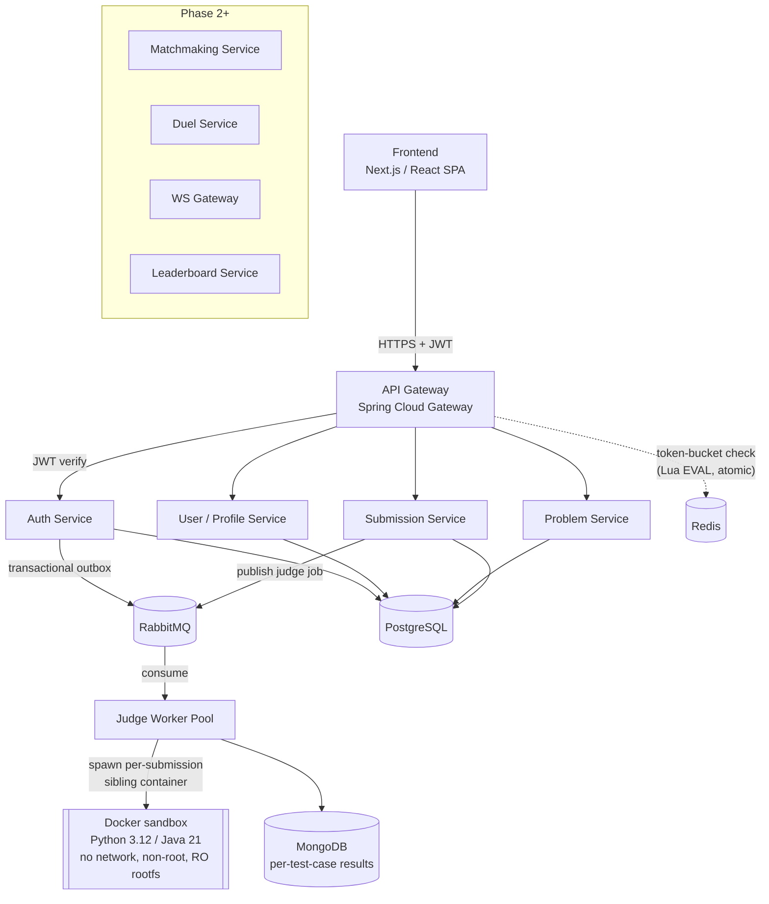

# LeetDuel

A LeetCode-style problem practice platform with real-time, ELO-ranked 1v1 coding duels — built as a microservices system to exercise the full breadth of a modern backend/systems design: async messaging, polyglot persistence, sandboxed untrusted-code execution, real-time push, and Kubernetes deployment with metrics.

## Executive summary

LeetDuel is a from-scratch distributed system, not a CRUD app with a queue bolted on. Each service owns one responsibility and one data store; services talk to each other over RabbitMQ (task queues + topic-exchange fanout) and Redis (hot state, rate limiting), never by reaching into another service's database. The judge itself runs untrusted user code inside locked-down, ephemeral Docker containers — no network, non-root, read-only root filesystem, resource-limited — the same class of problem Judge0 and competitive-programming judges solve in production.

## What it does

- **Auth:** email/password signup with verification, login, refresh-token rotation, password reset, Google OAuth — all JWT-based, validated at the API Gateway before any request reaches a backend service.
- **Practice mode:** browse problems by tag/difficulty, write a solution in Python or Java, submit it, get back a per-test-case verdict from a sandboxed judge worker.
- **Ranked duels:** join a queue, get ELO-matched against an opponent within an expanding rating window, race to solve the same problem live, opponent's progress bar updates over WebSocket, ELO adjusts on completion.

## System design



Full design rationale — service boundaries, delivery guarantees, ELO/matchmaking algorithm, data-store choices — is written up in [`docs/goals.md`](docs/goals.md).

## Tech stack

| Layer | Choice |
|---|---|
| Backend services | Java 21, Spring Boot 4.1 (WebMVC + WebFlux for the reactive Gateway), Spring Security, Spring Data JPA, Flyway |
| API Gateway | Spring Cloud Gateway — JWT validation, routing, Redis-backed token-bucket rate limiting |
| Auth | JWT (JJWT/HS256), refresh-token rotation, Google OAuth2, transactional outbox for event publishing |
| Async messaging | RabbitMQ — task queues (judge jobs) + topic exchange (event fanout) |
| Data stores | PostgreSQL (relational core: users, problems, submissions metadata), MongoDB (variable-shape per-test-case judge output), Redis (rate limiting; matching/leaderboard/WS sessions once built) |
| Code execution | Docker (`docker-java` client) — ephemeral, resource-limited sandbox containers per submission |
| Frontend | Next.js 16, React 19, TypeScript, Tailwind CSS 4 |
|Planned  | Kubernetes + Helm, Prometheus + Grafana (Actuator/Micrometer already wired per-service) |

## How to run

**Prerequisites:** Docker Desktop, JDK 21, Node.js 20+.

1. **Start local infra** (Postgres, MongoDB, Redis, RabbitMQ, admin UIs, and the containerized Judge Worker):
   ```bash
   docker compose -f docker-compose.infra.yml up -d
   ```

2. **Build the judge's sandbox images** (one-time, or after changing `docker/sandbox-*`):
   ```powershell
   ./scripts/build-sandbox-images.ps1
   ```

3. **Run each Spring Boot service** (each is an independent Gradle project):
   ```bash
   cd services/auth-service && ./gradlew bootRun        # :8082
   cd services/user-service && ./gradlew bootRun        # :8083
   cd services/gateway && ./gradlew bootRun             # :8084
   cd services/problem-service && ./gradlew bootRun     # :8085
   cd services/submission-service && ./gradlew bootRun  # :8086
   # judge-worker already runs via docker-compose above (:8087)
   ```
   `auth-service` needs `GMAIL_USERNAME`/`GMAIL_APP_PASSWORD` env vars for verification emails (a Gmail app password, not the account password) and optionally `JWT_SECRET` (falls back to a dev-only default otherwise).

4. **Run the frontend:**
   ```bash
   cd frontend && npm install && npm run dev
   ```
   Open `http://localhost:3000`. `frontend/.env.local` already points `NEXT_PUBLIC_AUTH_API_URL` at `auth-service` (`:8082`).

**Admin UIs** (brought up by step 1, throwaway local-dev credentials `leetduel` / `leetduel_dev`):

| UI | URL |
|---|---|
| RabbitMQ management | http://localhost:15672 |
| pgAdmin | http://localhost:5050 |
| Mongo Express | http://localhost:8081 |
| RedisInsight | http://localhost:5540 |
