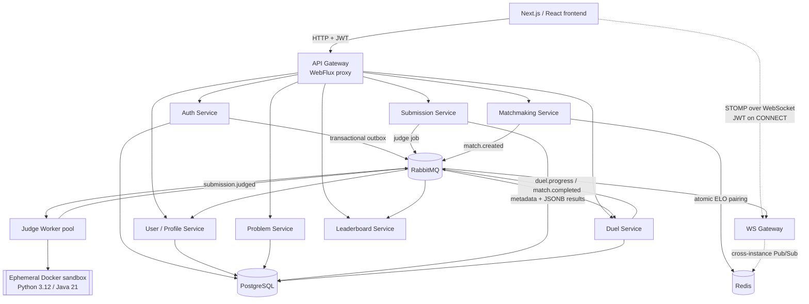

# LeetDuel

LeetDuel is a distributed coding platform where developers practice problems and compete in real-time, ELO-ranked 1v1 duels.

It is built as a backend-heavy systems project rather than a CRUD application with a queue attached. The implementation focuses on service boundaries, asynchronous workflows, safe execution of untrusted code, Redis-backed coordination, real-time fanout, and failure-aware data consistency.

## Resume summary

- Designed and implemented a Java 21 / Spring Boot microservices platform with ten independently deployable backend services and a Next.js frontend.
- Built an asynchronous judge pipeline with RabbitMQ and ephemeral Docker sandboxes for Python and Java submissions, including CPU, memory, timeout, network, non-root, and read-only filesystem controls.
- Implemented horizontally safe ELO matchmaking with Redis sorted sets and atomic Lua scripts, plus optimistic-lock-guarded duel completion and transactional outbox publishing.
- Implemented STOMP real-time duel updates through a standalone WebSocket gateway using RabbitMQ to Redis Pub/Sub to local broker fanout.
- Added a Redis materialized leaderboard with global, weekly, and seasonal rankings, atomic period-score idempotency, rank lookup, and surrounding-player queries.

## Product flow

1. A user signs up or logs in and receives a short-lived JWT plus a rotating refresh token.
2. The user browses a problem and submits Python or Java code.
3. Submission Service publishes a judge job. Judge Worker runs the code in an ephemeral sandbox and publishes the verdict asynchronously.
4. For ranked play, two users join the matchmaking queue. Matchmaking pairs them by ELO using an expanding search window.
5. Duel Service owns the match lifecycle. Each accepted submission updates progress, and the first player to solve all tests wins.
6. `match.completed` is published once through the duel outbox. User Service applies ELO and W/L/D stats, while Leaderboard Service updates its Redis read model.
7. The frontend receives live opponent progress and the final result over WebSocket.

## Architecture



## Services

| Service | Responsibility | Primary technology / state |
|---|---|---|
| API Gateway | JWT validation, routing, CORS, token-bucket rate limiting | Spring WebFlux, Redis Lua |
| Auth Service | Signup, verification, login, refresh rotation, password reset, Google OAuth | Spring Security, JWT, PostgreSQL |
| User/Profile Service | ELO, duel stats, rating history, public profile reads | Spring Data JPA, PostgreSQL |
| Problem Service | Problems, tags, difficulty, test cases, language stubs | Spring Data JPA, PostgreSQL |
| Submission Service | Submission metadata, judge-job publication, verdict reads | Spring Data JPA, PostgreSQL JSONB |
| Judge Worker | Sandboxed Python/Java execution and verdict publication | Spring AMQP, Docker Engine |
| Matchmaking Service | ELO queueing, expanding-window pairing, expiry | Redis sorted sets, Lua, RabbitMQ |
| Duel Service | Match state, progress, timeout/winner resolution, ELO calculation | PostgreSQL, optimistic locking |
| WS Gateway | Authenticated STOMP connections and horizontally scalable event fanout | WebSocket, RabbitMQ, Redis Pub/Sub |
| Leaderboard Service | Global, weekly, seasonal ranked read model | Redis sorted sets, Lua, RabbitMQ |

## Design decisions worth discussing

### PostgreSQL instead of MongoDB for judge results

MongoDB was initially considered for variable-shaped per-test-case output, but it was removed from the implemented architecture. Submission results are now stored as JSONB in Submission Service's PostgreSQL-owned schema.

This keeps the local stack smaller and preserves the relational benefits needed for ownership, submission history, and transactional metadata. JSONB still handles variable-length test-result payloads without introducing a second durable database. The judge worker remains stateless: it executes code and publishes events; Submission Service owns the persisted result.

### RabbitMQ for asynchronous work and events

RabbitMQ provides durable task queues for judge jobs and matchmaking requests, and a durable topic exchange for `match.created`, `duel.progress`, and `match.completed` fanout. Each consumer has its own queue, so a slow or unavailable consumer does not prevent other consumers from receiving the event.

Consumers assume at-least-once delivery. User Service deduplicates completed matches in PostgreSQL. Leaderboard Service uses `ZADD` for absolute global ELO and an atomic Lua check-then-increment script for additive weekly and seasonal scores.

Kafka and event replay are intentionally deferred. At this project's scale, RabbitMQ provides the required queue and fanout semantics with less operational overhead.

### Redis for coordination and read models

Redis stores hot or derived state: matchmaking indexes, rate-limit buckets, WebSocket Pub/Sub relay state, and leaderboard sorted sets. Durable source-of-truth records remain in service-owned PostgreSQL schemas.

Lua scripts close check-then-act races for token buckets and matchmaking. Leaderboard period keys include the ISO week or calendar quarter, so period rollover starts writing to a new key without a reset job.

### Transactional outbox

Database changes that produce RabbitMQ events write an outbox row in the same transaction as the business record. A poller publishes pending rows and marks them sent. If a service crashes after the database commit, the event remains available for the next relay attempt.

The trade-off is polling latency and repeated indexed queries. CDC/Debezium would reduce that latency but would add infrastructure that is not justified for this project.

### Real-time duel fanout

The API Gateway is an HTTP-only hand-rolled WebFlux proxy, so WebSocket connections go directly to WS Gateway. WS Gateway authenticates the JWT on the STOMP `CONNECT` frame, consumes duel events from RabbitMQ, republishes them through Redis Pub/Sub, and forwards them through each instance's local STOMP broker.

This lets two players connected to different WS Gateway instances receive the same match updates. The REST match read remains the source of truth for initial state and reconnect recovery; WebSocket carries live deltas.

## Security and reliability

- JWT verification occurs at the API Gateway for HTTP and on the STOMP `CONNECT` frame for WebSocket.
- The Gateway strips caller-supplied identity headers before adding verified `X-User-Id` headers.
- Judge containers run with no network, a read-only root filesystem, non-root execution, resource limits, and forced cleanup.
- Duel completion uses JPA optimistic locking so simultaneous submissions or timeout races cannot publish two winners.
- RabbitMQ queues and the transactional outbox tolerate service restarts; idempotent consumers tolerate redelivery.
- MongoDB is not required anywhere in the current build.

## Tech stack

| Layer | Technologies |
|---|---|
| Backend | Java 21, Spring Boot 4.1, Spring MVC/WebFlux, Spring Security |
| Persistence | PostgreSQL, Spring Data JPA, Flyway, JSONB |
| Messaging | RabbitMQ, transactional outbox, Jackson message conversion |
| Hot state | Redis, sorted sets, Pub/Sub, atomic Lua scripts |
| Code execution | Docker Engine, docker-java, Python 3.12, Java 21 |
| Frontend | Next.js 16, React 19, TypeScript, Tailwind CSS 4, STOMP.js |
| Planned next | Kubernetes/Helm deployment and Prometheus/Grafana dashboards |

## Run locally

### Prerequisites

- Docker Desktop
- JDK 21
- Node.js 20+
- PowerShell for the sandbox image helper

### 1. Start infrastructure and containerized services

```bash
docker compose -f docker-compose.infra.yml up -d
```

This starts PostgreSQL, Redis, RabbitMQ, pgAdmin, RedisInsight, RabbitMQ management, Judge Worker, Duel Service, WS Gateway, and Leaderboard Service. MongoDB is not part of the stack.

### 2. Build sandbox images

```powershell
./scripts/build-sandbox-images.ps1
```

### 3. Run local Spring services

Each service is an independent Gradle project:

```bash
cd services/auth-service && ./gradlew bootRun          # :8082
cd services/user-service && ./gradlew bootRun          # :8083
cd services/gateway && ./gradlew bootRun               # :8084
cd services/problem-service && ./gradlew bootRun       # :8085
cd services/submission-service && ./gradlew bootRun    # :8086
cd services/matchmaking-service && ./gradlew bootRun   # :8088
```

Auth email verification requires `GMAIL_USERNAME` and `GMAIL_APP_PASSWORD`. Set `JWT_SECRET` to a strong shared secret for non-development environments.

### 4. Run the frontend

```bash
cd frontend
npm install
npm run dev
```

Open [http://localhost:3000](http://localhost:3000). The frontend uses Auth Service on `:8082`, API Gateway on `:8084`, and WS Gateway on `:8090` by default.

## Useful local URLs

| Component | URL |
|---|---|
| Frontend | http://localhost:3000 |
| RabbitMQ management | http://localhost:15672 |
| pgAdmin | http://localhost:5050 |
| RedisInsight | http://localhost:5540 |

Local admin credentials are `leetduel` / `leetduel_dev` where applicable. They are development-only credentials.

## Verification

Frontend checks:

```bash
cd frontend
npm run lint
npx tsc --noEmit
npm run build
```

Backend checks can be run per service:

```bash
cd services/<service-name>
./gradlew test
```

The most valuable integration checks use Testcontainers for Redis Lua-script concurrency and idempotency behavior.

## Project status

- Phase 0: foundations, authentication, Gateway, and User Service complete.
- Phase 1: asynchronous sandboxed judge loop complete.
- Phase 2: Redis-backed ELO matchmaking complete.
- Phase 3: real-time duel lifecycle and WebSocket fanout complete.
- Phase 4: leaderboard, profile stats, ELO history, and match history complete.
- Next: Kubernetes deployment, then Prometheus/Grafana observability.

For the deeper design rationale and learning path, see [`docs/goals.md`](docs/goals.md) and [`docs/LEARN_AND_BUILD.md`](docs/LEARN_AND_BUILD.md).
